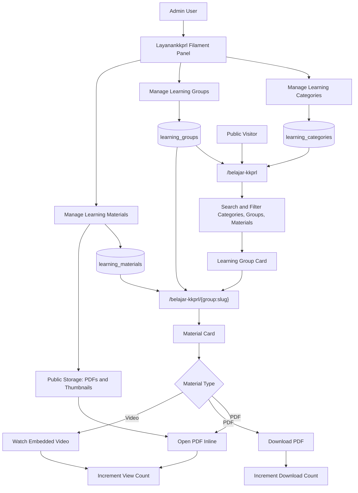
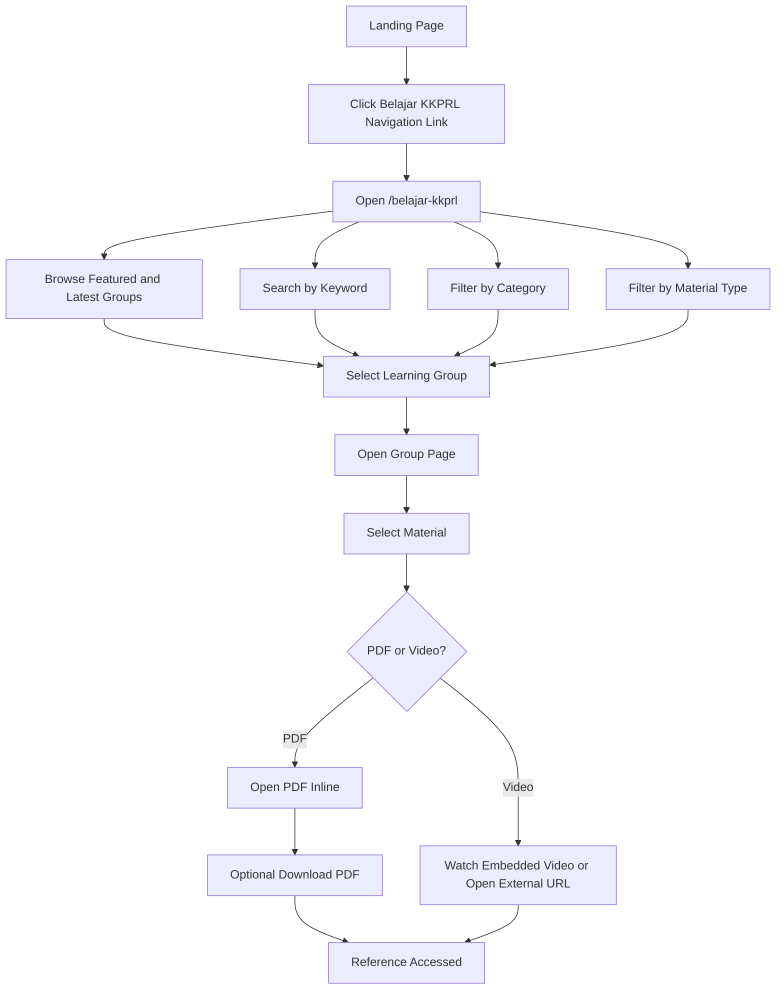
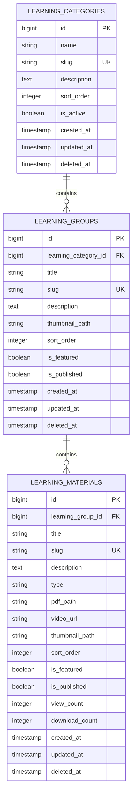

# PRD: Belajar KKPRL

## 1. Summary

**Belajar KKPRL** is a public learning reference feature for the LPRL Sorong service website. It provides simple, admin-curated KKPRL learning materials in PDF and external video format so the public can understand KKPRL requirements, procedures, and supporting references without logging in.

This feature is intentionally not a full LMS. It does not include learner accounts, enrollment, certificates, quizzes, comments, or progress tracking. The core purpose is to help the public find trusted KKPRL learning references quickly.

The content structure is hierarchical:

```text
Learning Category > Learning Group > Learning Material
```

Example:

```text
Category: Ekosistem Pesisir
Group: Pengumpulan Data Ekosistem
Materials:
- Mangrove PDF
- Mangrove Video
- Lamun PDF
- Lamun Video
- Terumbu Karang PDF
- Terumbu Karang Video
```

## 2. Goals

- Provide a dedicated public page for KKPRL learning references.
- Allow admins to manage learning categories, groups, and materials from Filament.
- Support grouped learning themes such as ecosystem data collection.
- Support PDF and external video learning materials.
- Make groups and materials easy to search, filter, open, and download.
- Keep the experience simple, official, and accessible to the public.

## 3. Users

- **Public visitors**: masyarakat, pemohon layanan, konsultan, pemerintah daerah, or other stakeholders who need KKPRL references.
- **Admin users**: internal staff who prepare, upload, publish, and organize learning materials.
- **Service operators**: staff who may direct users to official references during consultation.

## 4. Scope

### In Scope

- Public `/belajar-kkprl` page.
- Learning categories as high-level topic filters.
- Learning groups as structured themes inside categories.
- Learning materials inside learning groups.
- PDF upload and public inline viewing.
- PDF download action.
- External video URL support.
- Search and filters.
- Featured groups and materials.
- Anonymous view and download counts.
- Filament admin resources inside the existing `Layanankkprl` panel.

### Out of Scope

- User login for learners.
- Certificates.
- Course enrollment.
- Lesson completion or progress.
- Quizzes or exams.
- Comments or discussion.
- Paid content.
- Uploaded video hosting.
- Separate Filament panel.

## 5. Product Decisions

- Belajar KKPRL will use the existing **Layanankkprl Filament panel**.
- Admin navigation will be grouped under **Belajar KKPRL**.
- V1 content hierarchy is **Category > Group > Material**.
- Every material must belong to a learning group.
- V1 material types are only:
  - PDF.
  - External video URL.
- Public visitors do not need to log in.
- PDF files open inline and also have a download action.
- Video materials use external URLs, preferably YouTube-compatible.
- Usage metrics are simple anonymous counters only.

## 6. Feature Architecture



## 7. Public User Experience

The public page should be available at:

```text
/belajar-kkprl
```

The page should include:

- Page title: **Belajar KKPRL**.
- Short description explaining that the page contains public learning references about KKPRL.
- Search input.
- Category filter.
- Type filter: Semua, PDF, Video.
- Featured learning groups section.
- Featured or latest materials section.
- Learning group list or grid.
- Empty state when no groups or materials exist.
- No-result state when filters return no results.

Each learning group card should show:

- Title.
- Category.
- Short description.
- Number of published materials.
- Available material types, such as PDF and Video.
- Primary action: **Buka Grup**.

Each material card should show:

- Title.
- Learning group.
- Category.
- Type badge: PDF or Video.
- Short description.
- View count.
- Primary action:
  - PDF: **Buka PDF**.
  - Video: **Tonton Video**.
- Secondary PDF action:
  - **Unduh PDF**.

## 8. Public Browsing Flow



## 9. Admin Experience

Inside the existing `Layanankkprl` Filament panel, add a navigation group:

```text
Belajar KKPRL
- Kategori Pembelajaran
- Grup Pembelajaran
- Materi Pembelajaran
```

### Category Admin

Admins can:

- Create category.
- Edit category.
- Delete or soft delete category.
- Set display order.
- Activate or deactivate category.

Category fields:

- Name.
- Slug.
- Description.
- Sort order.
- Is active.

### Group Admin

Admins can:

- Create learning group.
- Edit learning group.
- Delete or soft delete learning group.
- Assign group to a category.
- Set display order.
- Mark as featured.
- Publish or unpublish group.

Group fields:

- Title.
- Slug.
- Category.
- Description.
- Thumbnail path.
- Sort order.
- Is featured.
- Is published.

### Material Admin

Admins can:

- Create material.
- Edit material.
- Delete or soft delete material.
- Assign material to a learning group.
- Select material type.
- Upload PDF for PDF material.
- Add video URL for video material.
- Add optional thumbnail.
- Mark as featured.
- Publish or unpublish.
- Set display order.

Material fields:

- Title.
- Slug.
- Learning group.
- Description.
- Type: `pdf` or `video`.
- PDF path.
- Video URL.
- Thumbnail path.
- Sort order.
- Is featured.
- Is published.
- View count.
- Download count.

## 10. Data Model

Create three main tables: `learning_categories`, `learning_groups`, and `learning_materials`.

### `learning_categories`

High-level topic, for example `Ekosistem Pesisir`.

Required fields:

- `id`
- `name`
- `slug`
- `description`
- `sort_order`
- `is_active`
- `created_at`
- `updated_at`
- `deleted_at`

### `learning_groups`

Structured learning theme inside a category, for example `Pengumpulan Data Ekosistem`.

Required fields:

- `id`
- `learning_category_id`
- `title`
- `slug`
- `description`
- `thumbnail_path`
- `sort_order`
- `is_featured`
- `is_published`
- `created_at`
- `updated_at`
- `deleted_at`

### `learning_materials`

Individual PDF or video item inside a learning group.

Required fields:

- `id`
- `learning_group_id`
- `title`
- `slug`
- `description`
- `type`
- `pdf_path`
- `video_url`
- `thumbnail_path`
- `sort_order`
- `is_featured`
- `is_published`
- `view_count`
- `download_count`
- `created_at`
- `updated_at`
- `deleted_at`

## 11. Entity Relationship Diagram



## 12. Business Rules

- Only active categories appear publicly.
- Only published groups appear publicly.
- Only published materials appear publicly.
- Groups in inactive categories do not appear publicly.
- Materials in unpublished groups do not appear publicly.
- Materials in inactive categories do not appear publicly through their parent group.
- Every material must belong to one learning group.
- Every learning group must belong to one category.
- PDF material requires a PDF file.
- Video material requires a video URL.
- PDF material does not require a video URL.
- Video material does not require a PDF file.
- Slugs are generated from name or title and must be unique per table.
- Public view count increments when a material is opened.
- Download count increments when a PDF download action is used.

## 13. Routes

Public routes:

- `GET /belajar-kkprl`
  - Displays categories, groups, featured groups/materials, search, and filters.
- `GET /belajar-kkprl/{group:slug}`
  - Shows one learning group and all published materials inside it.
- `GET /belajar-kkprl/materi/{material:slug}/pdf`
  - Opens PDF inline.
- `GET /belajar-kkprl/materi/{material:slug}/download`
  - Downloads PDF and increments download count.

Route behavior:

- Inactive category returns 404 for its groups and materials.
- Unpublished group returns 404.
- Unpublished material returns 404.
- Missing PDF file returns 404.
- Video material should not expose PDF routes.

## 14. Permissions

Use the existing Filament authorization and Shield pattern.

Suggested permissions:

- View learning categories.
- Create learning categories.
- Edit learning categories.
- Delete learning categories.
- View learning groups.
- Create learning groups.
- Edit learning groups.
- Delete learning groups.
- View learning materials.
- Create learning materials.
- Edit learning materials.
- Delete learning materials.

## 15. Success Metrics

- Public users can access `/belajar-kkprl` without login.
- Admins can publish grouped learning references without developer assistance.
- Visitors can find groups and materials by search and filter.
- PDF materials can be opened and downloaded.
- Video materials can be watched or opened.
- Admins can see basic popularity through view and download counts.

## 16. Acceptance Criteria

- Public page loads without authentication.
- Public page shows only published groups from active categories.
- Public group pages show only published materials.
- Search works by category name, group title/description, and material title/description.
- Category filter works.
- Type filter works based on material types inside groups.
- Featured groups and materials appear separately or first.
- Admin can create, edit, publish/unpublish, order, and delete learning groups.
- Admin can create PDF material.
- Admin can create video material.
- Admin can publish and unpublish material.
- Admin can activate and deactivate category.
- Public page can display materials grouped under a learning group.
- Inactive categories hide their groups and materials.
- Unpublished groups hide their materials.
- Published materials only appear when their group and category are publicly active.
- PDF opens inline in browser.
- PDF download increments download count.
- Opening a material increments view count.
- Unpublished content cannot be accessed directly by slug.
- Navigation link to **Belajar KKPRL** appears on desktop and mobile landing page nav.

## 17. Assumptions

- Existing public website styling should be reused.
- Existing `Layanankkprl` Filament panel remains the admin home for this feature.
- Learning groups are required for every material.
- Categories remain useful as the highest-level public filter.
- PDF max upload size follows the current regulation pattern: 10 MB.
- Video hosting is external and not handled by the Laravel app.
- No personal learner data is stored.
- The feature remains simple: no login, no certificate, no quiz, and no user progress.
