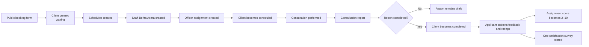
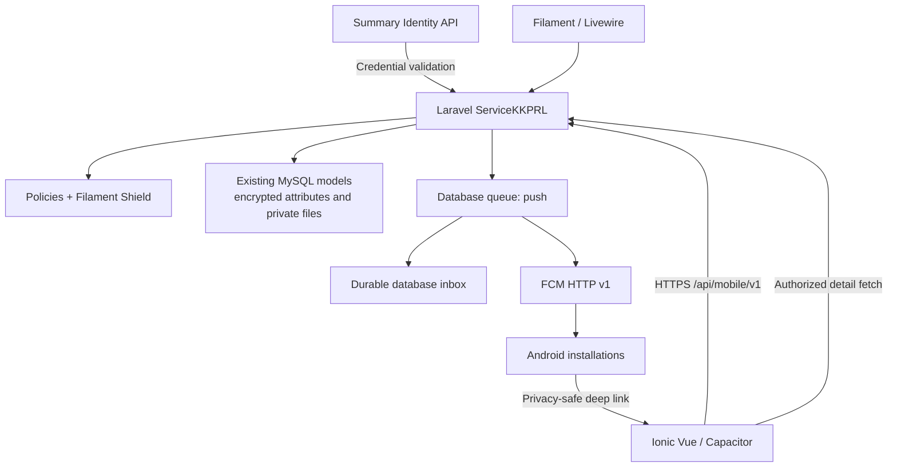

# ServiceKKPRL Mobile Application Development Plan

## Document control

| Item | Value |
|---|---|
| Product | ServiceKKPRL |
| Mobile package | `com.timurbersinar.servicekkprl` |
| Initial platform | Android 10+ |
| Future platform | iOS-ready architecture; iOS is not part of v1 |
| Mobile stack | Ionic Vue, Vue 3, TypeScript, Capacitor |
| Backend | Existing Laravel application |
| Distribution | Firebase App Distribution |
| API base | `/api/mobile/v1` |
| API contract | `1.0` |
| Canonical timezone | `Asia/Jayapura` |
| Status | Initial v1 implementation completed; environment configuration and UAT remain |

## 1. Purpose

ServiceKKPRL is an internal operational companion to the existing `layanankkprl`
Filament panel. It gives authorized officers and administrators immediate access
to daily service activity and durable, real-time notifications without replacing
the established web application.

The mobile application does not implement a parallel workflow. Laravel remains
the single source of truth for identity brokering, Filament Shield permissions,
policies, validation, encrypted data, private files, service transitions,
e-mail, notifications, and audit behavior.

## 2. Locked scope

Version 1 includes:

- A capability-filtered operational dashboard.
- All Requests and My Requests.
- Request detail and policy-permitted edits.
- Schedule creation and adjustment.
- Officer assignment/reassignment and attendance status.
- Consultation report creation and completion with documentation.
- Berita Acara data, participants, signatures, attachments, public links, and
  existing PDF output through authenticated API endpoints.
- Satisfaction surveys, criticism, suggestions, assessments, and public
  feedback as permission-filtered operational views.
- A durable notification inbox and Firebase push delivery.
- Profile, roles, permissions, device registration, current-device logout,
  all-device logout, maintenance mode, and minimum-version enforcement.

Version 1 intentionally excludes:

- Deletes, force deletes, restores, and bulk destructive operations.
- User, role, permission, or master-data administration.
- Learning and publication administration.
- Excel exports.
- Full Filament administration parity.
- Offline writes.

These exclusions prevent the APK from introducing new workflow semantics or
high-risk administration outside the existing panel.

## 3. Existing system baseline

The established system uses Laravel 13, PHP 8.2+, Filament 5, Livewire 4,
Filament Shield with Spatie Permission, MySQL, database queues, SMTP e-mail,
encrypted model accessors, and private file storage.

The panel ID is `layanankkprl`, its local path is `/layananruanglaut`, and the
production host is `kawanruanglaut.timurbersinar.com`.

Filament authentication brokers credentials through the Summary identity API,
synchronizes a local user, and then uses local Shield roles and permissions.
The mobile implementation preserves the same sequence:

1. The APK sends credentials only to this Laravel application.
2. Laravel validates the credentials with Summary.
3. Laravel synchronizes the established local user fields.
4. Laravel checks local active status and usable Shield capabilities.
5. Laravel issues an expiring Sanctum personal access token for the installation.
6. Every subsequent request re-evaluates the current local policy permissions.

No Summary role is copied into the local application. A valid Summary user with
no usable local capability receives `mobile_access_not_assigned`.

## 4. Established lifecycle



The implementation leaves the following behavior in place:

- New clients default to `waiting`.
- Public booking remains an atomic transaction.
- The first assignment can move a waiting client to `scheduled`.
- Removing the final assignment keeps the current reversion behavior.
- Completing a consultation report moves the client to `completed`.
- Ratings remain mapped from 1–5 stars to scores 2–10.
- Satisfaction feedback remains unique per client.
- Berita Acara signing uses the existing three-business-day calculation.
- Existing e-mails and model-observer side effects remain active.

## 5. Architecture



Architectural rules:

- The mobile client never connects directly to MySQL or sends FCM server calls.
- API controllers validate, authorize, invoke application behavior, and
  transform results.
- Nested resource ownership is checked against the ticket in the route.
- New notification jobs are dispatched after the originating transaction.
- Push failures are isolated from the service transaction and existing e-mail.
- Capabilities, not role names, drive the UI.
- The server authorizes every operation even when its UI control is hidden.
- API and payload versions are independent of APK versions.

## 6. Repository layout

```text
app/
  Actions/Mobile/
  Http/Controllers/Api/Mobile/V1/
  Http/Middleware/
  Jobs/
  Models/
  Notifications/
  Observers/
  Services/
  Support/
database/migrations/
docs/
mobile/
  android/
  src/
    api/
    components/
    notifications/
    pages/
    router/
    storage/
    stores/
    theme/
    types/
  tests/
routes/api.php
```

The native Android project is tracked because its minimum OS, manifest security,
deep links, signing, notification channels, and Firebase configuration require
native control. Generated web assets and local build/secrets files are ignored.

## 7. Authentication and device lifecycle

Laravel Sanctum tokens:

- Are named `servicekkprl:{installation_id}`.
- Have a 30-day default expiration.
- Carry only a coarse `mobile` ability; Shield policies remain authoritative.
- Are stored only by the Keystore-backed secure-storage adapter.
- Are revoked on logout.
- Are all revoked by logout-all.
- Are not returned after the login response.

Login is limited to five attempts per minute by the route throttle. Production
must additionally apply an upstream IP-aware rate limiter.

The `user_devices` registry supports multiple installations per user and both
`android` and `ios`. It stores an encrypted registration value and deterministic
hash, permission state, installation/app metadata, last activity, and disabling
timestamps. The legacy `users.fcm_token` column is retained but is not used as
the new source of truth.

Registration is updated at login, app start, permission changes, and FCM token
refresh. Logout disables the current registration. Rejected FCM registrations
are disabled by the push worker.

## 8. Capability model

The backend returns server-calculated booleans for:

- Dashboard.
- Clients.
- Schedules.
- Assignments.
- Consultation reports.
- Berita Acara.
- Satisfaction surveys.
- Public feedback.
- Notification inbox.

Resource permission names map to the existing Shield names. No role-name
conditional exists in the APK or API. Notification access alone does not count
as operational mobile access.

Before pilot, export the live matrix for `Pegawai`, `Pengelola`, `Pimpinan`, and
`super_admin` and obtain owners' approval for any permission changes. Do not
change the matrix as part of application deployment.

## 9. API conventions

- Base: `/api/mobile/v1`.
- JSON by default; multipart for reports, signatures, and attachments.
- Cursor pagination for client and notification lists.
- ISO-8601 timestamps.
- Request ID returned as `X-Request-Id` and in error bodies.
- Resources return a timestamp-derived `version`.
- Mutating requests return `409 record_changed` for stale versions.
- Validation returns `422 validation_failed`.
- Authorization returns `403 forbidden`.
- Missing or deliberately hidden resources return `404`.

Error shape:

```json
{
  "message": "The submitted data is invalid.",
  "code": "validation_failed",
  "request_id": "019...",
  "errors": {
    "date": ["The date field is required."]
  }
}
```

Implemented endpoint groups:

| Group | Endpoints |
|---|---|
| Configuration | app configuration, version and maintenance state |
| Authentication | login, logout, logout all |
| Account | profile, capabilities, device upsert/disable |
| Dashboard | authorized counters and recent work |
| Clients | All/My filters, detail, permitted update |
| Schedules | create and update |
| Staff | authorized active-user lookup |
| Assignments | bulk create, reassignment, attendance/status update |
| Reports | list, create, update, private documentation |
| Berita Acara | read/create/update, participants, signatures, attachments, links, PDF |
| Feedback | satisfaction and public feedback list/detail |
| Notifications | cursor inbox, detail, unread count, read, read all |
| Files | authenticated private files, ticket, report PDF, BA PDF |

The machine-readable contract is maintained in
`docs/servicekkprl-mobile-api-v1.openapi.yaml`.

## 10. Notification design

Laravel database notifications are the durable inbox. The `push` database queue
delivers FCM HTTP v1 messages using a service account located outside the
repository.

Events include:

- New request.
- Assignment created/reassigned/status changed.
- Schedule created/changed.
- Satisfaction criticism/suggestion and officer assessment.
- Public feedback.

Recipients are resolved at event time:

| Event | Direct | Oversight |
|---|---|---|
| New request | — | `ViewAny:Client` |
| Assignment | affected officer | assignment create/update permission |
| Assignment status | affected officer | `UpdateAssignment` |
| Schedule | active assigned officers | `Update:Client` |
| Satisfaction/assessment | rated assigned officers | `ViewAny:SatisfactionSurvey` |
| Public feedback | selected authorized officers | `ViewAny:PublicFeedback` |

The related record is fetched separately after policy authorization. FCM data
may include notification UUID, event type, ticket, opaque subject ID, internal
route, occurrence time, and schema version. It must never include names, contact
details, feedback text, scores, meeting links, documents, signatures, tokens,
or private URLs.

Notification IDs are deterministic per event/user to make queue retries
idempotent. Delivery logs contain safe status/error metadata. Five attempts use
exponential backoff. Invalid registrations are disabled.

Android channels:

- `assignments` — high importance.
- `schedule_changes` — high importance.
- `new_requests` — default.
- `feedback` — default.
- `system_updates` — low/default.

## 11. Mobile experience

Bottom navigation contains Beranda, Layanan, Notifikasi, and Profil. Screens and
actions render only when the capability document permits them.

Implemented flows include:

- Startup configuration/version check.
- Summary-backed login.
- Runtime push permission and channel registration.
- Dashboard and recent requests.
- Request filtering and My Requests.
- Request details, status, schedules, assignments, reports, and Berita Acara.
- Permission-filtered feedback.
- Durable inbox and notification deep links.
- Profile, role/permission diagnostics, logout, and logout-all.
- Maintenance and mandatory update screens.

The app is online-first. It never queues offline writes. TanStack Query owns API
state and invalidation, Pinia owns session/UI state, and the Network plugin
surfaces connectivity. Tokens are secured natively. Sensitive documents,
signatures, feedback text, meeting links, and contact data are not deliberately
persisted as offline records.

## 12. Android and iOS readiness

Android settings:

- Package ID `com.timurbersinar.servicekkprl`.
- `minSdkVersion = 29` (Android 10).
- Target/compile SDK 36 in the generated Capacitor 8 project.
- Cleartext traffic disabled.
- Android backup disabled.
- Single-task activity for notification navigation.
- `servicekkprl://` deep links.
- Prepared HTTPS app-link route at
  `https://kawanruanglaut.timurbersinar.com/mobile/...`.

Future iOS remains possible because the API, route names, device rows, FCM data,
storage interface, and TypeScript logic are platform-neutral. An iOS phase must
add Keychain implementation verification, APNs/Firebase configuration,
universal-link association, Apple signing, and iOS notification QA.

## 13. Security controls

- HTTPS only and no Android cleartext.
- Android Keystore-backed secure storage.
- No password persistence.
- No backend credential in the web bundle or repository.
- Encrypted push registrations.
- Existing Laravel encrypted model accessors and private storage.
- Policy checks on all records and nested resources.
- Stale-write protection.
- Authenticated private-file streaming.
- MIME/count/size validation for uploads.
- Request identifiers and privacy-safe logs.
- Device/token revocation.
- Active-user middleware.
- APK signing and Firebase service credentials supplied only through protected
  deployment secrets.

The Firebase Android client file `google-services.json`, service-account JSON,
Summary secrets, Laravel production environment, and APK signing keys must not
be committed.

## 14. Testing strategy

Automated backend coverage includes:

- Existing lifecycle/data-protection characterization.
- Public app configuration.
- Summary-backed Sanctum login.
- Device registration.
- Refusal of locally unassigned access.
- Live Shield authorization.
- Stable forbidden responses.
- Stale-version conflict behavior.

Automated mobile coverage includes established status labeling and Laravel
validation error presentation. The production TypeScript build performs strict
type checking before Vite bundling.

Required UAT before internal production:

- Every endpoint and screen for all four live roles.
- Fresh install and update install on Android 10, 13, and a current Android
  release.
- Notification grant, denial, foreground, background, and terminated states.
- Deep link with valid, expired, and revoked sessions.
- Rolled-back transaction creates no push/inbox.
- Duplicate queue retry creates no duplicate inbox row.
- All notification event recipient matrices.
- Weak network, reconnect, and interrupted upload.
- Berita Acara signatures, participants, attachments, links, deadline, and PDF.
- Private file access and IDOR attempts.
- Font scaling, focus order, touch targets, labels, and contrast.

## 15. Deployment sequence

1. Back up the database and confirm rollback readiness.
2. Deploy code and run migrations.
3. Configure Summary, Firebase project/service account, app-version, and
   distribution environment values.
4. Start a dedicated `push` queue worker.
5. Install `google-services.json` in `mobile/android/app/`.
6. Build/test the Ionic bundle and sync Capacitor.
7. Build a signed release APK using protected signing values.
8. Generate SHA-256 checksum and release notes.
9. Upload to Firebase App Distribution pilot groups.
10. Set the latest build, initially without raising the minimum build.
11. Audit and sign off the Shield permission matrix.
12. Pilot each operational role and validate notification routing.
13. Expand the internal rollout.
14. Raise the minimum build only after adoption and rollback confidence.

## 16. Monitoring

Monitor queue depth, oldest push job, delivery success/failure by event, invalid
registration rate, active app versions, users below minimum build, API error
rate and p95 latency, Summary failures, authorization failures, upload errors,
and mobile startup/crash rate.

Alerts must not contain PII, feedback text, signatures, API tokens, or push
registration values.

## 17. Environment and release gates

The following are intentionally not supplied by source code and block a real
push-enabled signed APK until the deployment owner provides them:

- Firebase project ID and service-account credential path.
- Android `google-services.json`.
- Firebase App Distribution URL/groups.
- Android release keystore, alias, and passwords.
- Android SDK/JDK on the build agent.
- Approved production version/build values.
- Approved live Shield permission matrix.

These are release configuration gates, not reasons to alter the established
service flow.

