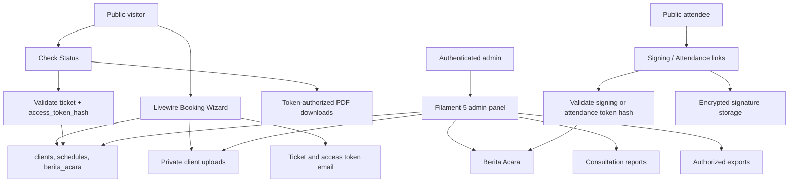
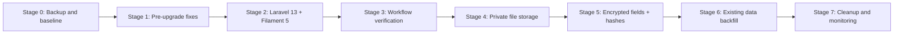

# PRD: Laravel 13, Filament 5, and Client Data Protection Upgrade

## Executive Summary

This document is the handoff plan for upgrading the KKPRL service website from Laravel 12 / Filament 4 to Laravel 13 / Filament 5, then adding client data protection through database encryption, hash-based lookup, and private file storage.

The update must be staged. Do not combine the framework upgrade, admin panel upgrade, encryption migration, and file migration into one release. This system already has existing client data and public token-based workflows, so every stage needs a verification checkpoint.

Primary outcomes:

- Upgrade Laravel to 13.x and Filament to 5.x with compatible package versions.
- Preserve public booking, status checking, report downloads, Berita Acara downloads, signing links, and attendance links.
- Preserve admin workflows for clients, assignments, reports, Berita Acara, exports, and roles.
- Encrypt sensitive personal data already stored in the database.
- Keep exact lookup available for operational fields by using HMAC hash columns.
- Move sensitive uploaded client files from public storage to private storage.

Reference documents:

- Filament 5 upgrade guide: https://filamentphp.com/docs/5.x/upgrade-guide
- Laravel 13 upgrade guide: https://laravel.com/docs/13.x/upgrade
- Laravel encrypted casting: https://laravel.com/docs/13.x/eloquent-mutators#encrypted-casting

## Current System Snapshot

Current verified stack:

- Laravel Framework: `12.44.0`
- Filament: `4.4.0`
- Livewire: `3.7.3`
- PHP used locally: `8.4.15`
- Database: MySQL / InnoDB
- Frontend build: Vite + Tailwind 4

Important package constraints currently blocking the target upgrade:

- `filament/filament` is constrained to `^4.0`.
- Filament 5 requires Livewire 4.
- Current Filament ecosystem packages must be upgraded together:
  - `bezhansalleh/filament-shield`
  - `pxlrbt/filament-excel`
  - `hugomyb/filament-media-action`
  - `asmit/filament-upload`
- Laravel 13 requires compatible updates for Laravel first-party and dev packages, including PHPUnit, Tinker, Pail, Sail, and Collision.

Main app areas:

- Public booking flow: `app/Livewire/BookingWizard.php`
- Public status flow: `app/Livewire/CheckStatus.php`
- Public signing flow: `app/Livewire/AttendeeSign.php`
- Public attendance flow: `app/Livewire/PublicAttendance.php`
- Service admin panel: `app/Filament/Layanankkprl`
- Data/admin panel: `app/Filament`
- Panel providers: `app/Providers/Filament`
- Public and download routes: `routes/web.php`
- Signature encryption service: `app/Services/SignatureService.php`

Known pre-upgrade issues:

- `php artisan test` currently fails because some migrations use MySQL-specific `ALTER TABLE ... MODIFY COLUMN ... ENUM` SQL while tests use SQLite.
- A default feature test expects `/` to return 200, but test routing/domain behavior currently returns 404.
- Client status values are inconsistent in parts of the code. The current database enum is `waiting`, `scheduled`, `completed`, but some UI/email/PDF code still references legacy values such as `pending`, `finished`, `in_progress`, and `canceled`.
- `app/Models/ActivityLog.php` contains duplicate class definitions for `NotificationLog` and `AiChatLog`, even though those models have their own files.
- Public booking stores applicant signature data directly into `berita_acara.tanda_tangan_pemohon`; it should use `SignatureService` like other signature flows.

## Goals and Non-Goals

Goals:

- Upgrade to Laravel 13 and Filament 5 without losing existing production data.
- Keep existing client ticket/token links valid.
- Keep all public and admin workflows operational.
- Encrypt sensitive database fields.
- Move sensitive files out of public storage.
- Provide repeatable verification steps for each stage.
- Make future exact lookup possible without decrypting every row.

Non-goals:

- Do not redesign the public website.
- Do not replace the business workflow for booking, assignment, report, or Berita Acara.
- Do not add partial-text search over encrypted personal data in this upgrade.
- Do not encrypt public regulatory content.
- Do not rotate `APP_KEY` as part of this work.
- Do not delete legacy plaintext columns until the encrypted backfill has been verified and a rollback window has passed.

## Architecture and Workflow Diagrams

### Public and Admin System Flow



### Staged Rollout



### Core Data Model

```mermaid
erDiagram
    services ||--o{ clients : selected
    consultation_locations ||--o{ clients : selected
    clients ||--o{ schedules : has
    schedules ||--o{ assignments : has
    users ||--o{ assignments : assigned
    clients ||--o{ consultation_reports : has
    clients ||--o| berita_acara : has
    berita_acara ||--o{ berita_acara_attendees : has
    clients ||--o| satisfaction_surveys : has
    clients ||--o{ notification_logs : logs

    clients {
        bigint id PK
        string ticket_number UK
        text access_token_encrypted
        char access_token_hash IDX
        text name_encrypted
        text email_encrypted
        char email_hash IDX
        text whatsapp_encrypted
        char whatsapp_hash IDX
        text instance_encrypted
        longtext address_encrypted
        longtext metadata_encrypted
        enum status
    }

    schedules {
        bigint id PK
        bigint client_id FK
        date date
        time start_time
        time end_time
        boolean is_online
        text meeting_link_encrypted
    }

    berita_acara {
        bigint id PK
        bigint client_id FK
        text attendance_url_token_encrypted
        char attendance_url_token_hash UK
        longtext lokasi_permohonan_encrypted
        longtext hasil_pendampingan_encrypted
        text tanda_tangan_pemohon
        enum status
    }

    berita_acara_attendees {
        bigint id PK
        bigint berita_acara_id FK
        text token_encrypted
        char token_hash UK
        text nama_encrypted
        text email_encrypted
        char email_hash IDX
        text no_hp_encrypted
        text tanda_tangan
    }
```

## Database Inventory and Proposed Changes

Laravel encrypted casts produce long, non-deterministic ciphertext. Do not store encrypted values in `varchar(255)`. Use `TEXT` or `LONGTEXT` for encrypted strings, arrays, JSON-like payloads, and rich text.

Encrypted values cannot be queried with normal `where`, `like`, or partial search. Use HMAC hash columns for exact lookup.

### Table Notes

| Table | Current sensitive fields | Required changes |
| --- | --- | --- |
| `clients` | `name`, `email`, `whatsapp`, `instance`, `address`, `metadata`, `supporting_documents`, `supporting_document_links`, `coordinate_file`, `access_token` | Add encrypted text/longtext fields or convert columns safely. Add `email_hash`, `whatsapp_hash`, and `access_token_hash`. Keep `ticket_number` plaintext and unique. |
| `schedules` | `meeting_link` | Encrypt `meeting_link` or restrict it to admin/client-token views. Preferred: encrypted `TEXT`. |
| `assignments` | `score` can be service feedback but is not highly sensitive alone | No encryption required. Keep relationship integrity and status enum stable. |
| `berita_acara` | `lokasi_permohonan`, `hasil_pendampingan`, `tanda_tangan_pemohon`, `attendance_url_token`, `lampiran_peta`, `lampiran_dokumentasi`, `lampiran_lainnya` | Encrypt sensitive text. Hash attendance token. Keep signatures and attachments private. |
| `berita_acara_attendees` | `nama`, `jabatan`, `instansi`, `email`, `no_hp`, `token`, `tanda_tangan` | Encrypt identity/contact fields. Hash signing token. Keep signatures private/encrypted. |
| `consultation_reports` | `content`, `feedback`, `documentation` | Encrypt content and feedback. Move documentation files private. |
| `satisfaction_surveys` | `criticism`, `suggestion` | Encrypt both fields. |
| `notification_logs` | `destination`, `message_body` | Encrypt destination. Prefer storing message type/template name instead of full body when possible. |

### Hash Columns

Use HMAC-SHA256 with an application secret. Recommended config key: `DATA_HASH_KEY`, separate from `APP_KEY`.

Required hash columns:

- `clients.email_hash`
- `clients.whatsapp_hash`
- `clients.access_token_hash`
- `berita_acara.attendance_url_token_hash`
- `berita_acara_attendees.token_hash`
- `berita_acara_attendees.email_hash`

Normalization rules:

- Email: lowercase and trim.
- WhatsApp / phone: trim and normalize to digits where possible.
- UUID/access tokens: trim and hash exact token.
- Empty values: store `null`, not the hash of an empty string.

### Plaintext Fields to Keep

Keep these unencrypted:

- Primary keys and foreign keys.
- `ticket_number`.
- Status enums.
- Dates/times needed for scheduling and filtering.
- Service/location IDs.
- Non-sensitive public regulation fields.

## Security and Encryption Strategy

### Database Encryption

Use Laravel encrypted casts or explicit accessor/mutator services for personal data.

Default approach:

- Add new encrypted columns first.
- Backfill from existing plaintext into encrypted columns.
- Switch app reads/writes to encrypted columns.
- Keep legacy plaintext columns temporarily during a rollback window.
- Remove or null legacy plaintext only after verification.

Do not add encrypted casts directly to existing plaintext columns before data is migrated. Doing so can break reads because existing values are not encrypted payloads.

### Token Handling

Current public token workflows must remain valid:

- Client status/report/BA download uses `ticket_number` + `access_token`.
- Attendance uses `attendance_url_token`.
- Signing uses attendee `token`.

Target behavior:

- Store token plaintext only encrypted.
- Store token HMAC in a separate indexed hash column.
- Query by hash, then use decrypted token only when generating URLs/emails.

Example query behavior:

- Status check: find client by `ticket_number` and `access_token_hash`.
- Attendance: find Berita Acara by `attendance_url_token_hash`.
- Signing: find attendee by `token_hash`.

### File Protection

Current sensitive uploaded files are often on the public disk. Move sensitive files to private storage.

Private file categories:

- Client supporting documents.
- Coordinate files.
- Consultation report documentation.
- Berita Acara attachments.
- Signatures.

Public file categories:

- Regulations intended for public download.
- Public website assets.

Required private file access patterns:

- Admin users access files through authenticated Filament actions or private download routes.
- Public clients access files only through ticket/token-authorized routes.
- Public attendees access only the specific signing/attendance resources permitted by their token.

Do not expose sensitive files through `/storage/...`.

## Step-by-Step Implementation Runbook

### Stage 0: Backup, Branch, and Baseline

1. Create a dedicated branch.

   ```bash
   git checkout -b codex/laravel13-filament5-data-protection
   ```

2. Back up production database and storage before any migration work.

   ```bash
   mysqldump --single-transaction --routines --triggers <database> > backup-before-upgrade.sql
   ```

3. Back up storage directories that contain client uploads and signatures.

   ```bash
   # Use the production server's preferred backup method.
   # Ensure storage/app/public and storage/app/private are included.
   ```

4. Capture current package state.

   ```bash
   php artisan about
   php artisan migrate:status
   php artisan route:list
   composer show --direct
   npm ls --depth=0
   ```

5. Run baseline tests and record failures.

   ```bash
   php artisan test
   npm run build
   ```

Expected baseline note: tests may fail before fixes because SQLite tests cannot run the current MySQL-specific enum migrations.

### Stage 1: Fix Pre-Upgrade Blockers

1. Align client statuses across code to the current database enum:

   - Use only `waiting`, `scheduled`, `completed`.
   - Update tabs, filters, forms, emails, PDFs, tests, and observers.
   - Remove legacy references to `pending`, `waiting_approval`, `in_progress`, `finished`, and `canceled` unless intentionally used for migration-only compatibility.

2. Make enum migrations test-safe.

   - Do not run MySQL `ALTER TABLE ... MODIFY COLUMN ... ENUM` statements on SQLite.
   - Use database-driver checks or schema-safe alternatives.
   - Ensure `php artisan test` can migrate from scratch.

3. Clean duplicate model definitions.

   - `ActivityLog.php` must define only `ActivityLog`.
   - `NotificationLog` and `AiChatLog` must remain in their own files.

4. Fix public booking signature storage.

   - Store applicant signatures through `SignatureService`.
   - Ensure existing BA PDF rendering still works.

5. Re-run:

   ```bash
   php artisan test
   php artisan route:list
   npm run build
   ```

Gate to continue: tests and build should pass, or remaining failures must be documented and unrelated to upgrade risk.

### Stage 2: Upgrade Laravel, Filament, Livewire, and Packages

1. Update Composer constraints together.

   Required target families:

   - `laravel/framework:^13.0`
   - `laravel/tinker:^3.0`
   - `filament/filament:^5.0`
   - `livewire/livewire:^4.0`
   - Latest compatible versions of Shield, Excel, upload, media action, DomPDF, Spatie permission, PHPUnit, Pail, Sail, and Collision.

2. Run Composer update with dependencies.

   ```bash
   composer update -W
   ```

3. Run framework/package discovery and Filament upgrade tooling.

   ```bash
   php artisan package:discover
   php artisan filament:upgrade
   ```

4. Review and fix breaking changes in:

   - Filament panel providers.
   - Filament resources, tables, schemas, relation managers, widgets, and pages.
   - Custom auth login page.
   - Custom `SignaturePad` field.
   - Filament Shield integration.
   - Filament Excel actions.
   - Asmit upload component usage.

5. Rebuild frontend assets.

   ```bash
   npm install
   npm run build
   ```

6. Run verification.

   ```bash
   php artisan test
   php artisan route:list
   php artisan about
   ```

Gate to continue: admin panels and public routes must load locally, tests/build must pass or have clearly documented non-blocking exceptions.

### Stage 3: Verify Current Workflows Before Encryption

Manually verify the unencrypted upgraded app before adding encryption.

Required checks:

- Public landing page loads.
- Booking wizard submits a new client.
- Email generation does not error.
- Admin can log in.
- Admin can view client list.
- Admin can edit client.
- Admin can assign staff.
- Admin can create a consultation report.
- Admin can create/edit Berita Acara.
- PDF ticket download works.
- PDF consultation report download works.
- PDF Berita Acara download works.
- Public check-status works with ticket/token.
- Public signing link works.
- Public attendance link works.
- Excel export still works for authorized admins.

Do not start encryption work until these pass.

### Stage 4: Add Private File Storage

1. Define or confirm private disk usage.

   - Use Laravel `local` disk rooted at `storage/app/private`.
   - Do not rely on `/storage` symlink for sensitive files.

2. Add private file download routes/controllers.

   Required access modes:

   - Authenticated admin access.
   - Public client access with ticket + access token.
   - Public attendee access only when appropriate for signing/attendance.

3. Update uploads for sensitive files to store on private disk:

   - Client supporting documents.
   - Coordinate file.
   - Consultation documentation.
   - Berita Acara attachments.
   - Signatures.

4. Update PDFs to read private files server-side.

   - Use `Storage::disk('local')->get(...)` or dedicated services.
   - Do not embed public URLs for sensitive files.

5. Backfill existing public file paths by copying files to private storage.

   - Keep mapping from old path to new private path.
   - Do not delete old public files until verification passes.

6. Verify:

   - Files download through authorized routes.
   - `/storage/...` URLs are no longer used for sensitive files.
   - PDF generation still embeds images/signatures correctly.

### Stage 5: Add Encrypted Columns and Hash Lookup

1. Add nullable encrypted and hash columns.

   Recommended pattern:

   - Add new columns first rather than modifying old columns in-place.
   - Use `text` for encrypted short strings.
   - Use `longText` for encrypted rich text, arrays, JSON-like values, and large content.
   - Add indexes for hash columns.

2. Add encryption casts or value objects.

   - Keep casts centralized in models.
   - Do not encrypt fields that need range/date filtering.

3. Add hash helper service.

   Required behavior:

   - Read `DATA_HASH_KEY` from config.
   - Normalize values before hashing.
   - Return `null` for blank input.
   - Use HMAC-SHA256.

4. Update writes.

   - New and edited client records populate encrypted fields and hash columns.
   - New token values populate encrypted token and token hash.
   - New sensitive content is never written only to plaintext fields.

5. Update reads.

   - UI, emails, PDFs, and exports read decrypted model attributes.
   - Query filters use plaintext operational fields or hash columns.

6. Update token queries.

   - Client status/download: `ticket_number` + `access_token_hash`.
   - Attendance: `attendance_url_token_hash`.
   - Signing: `token_hash`.

7. Update admin search.

   - Keep searchable: ticket number, exact email, exact WhatsApp, status, service, date, assigned officer.
   - Remove partial search from encrypted personal fields unless a separate search index is later implemented.

### Stage 6: Backfill Existing Client Data

1. Confirm backup exists.

2. Put the application in maintenance mode if running against production.

   ```bash
   php artisan down
   ```

3. Run a dry-run count command before writing data.

   Required counts:

   - Total clients.
   - Clients missing `access_token_hash`.
   - Clients missing encrypted identity fields.
   - Berita Acara rows missing attendance token hash.
   - Attendees missing token hash.
   - Sensitive public file paths needing migration.

4. Run backfill in chunks.

   Requirements:

   - Use transactions per chunk.
   - Disable model events/observers to prevent emails.
   - Do not call normal notification services.
   - Log counts and failures.
   - Skip already-backfilled rows safely.

5. Verify backfill.

   - All required hashes populated.
   - All required encrypted fields populated.
   - Randomly verify a small number of rows through the application only, not by exposing sensitive raw DB content.
   - Verify old ticket/token URLs still work.

6. Bring application back online.

   ```bash
   php artisan up
   ```

7. Keep legacy plaintext fields temporarily.

   - Do not drop them in the same release.
   - After a rollback window and successful monitoring, create a separate cleanup migration.

### Stage 7: Cleanup, Monitoring, and Final Verification

1. Run full automated verification.

   ```bash
   php artisan test
   php artisan route:list
   php artisan migrate:status
   npm run build
   ```

2. Run manual acceptance scenarios.

3. Review logs for:

   - Decrypt exceptions.
   - Missing private files.
   - 403/404 spikes on public token routes.
   - Failed email sends.
   - PDF generation errors.

4. Document final package versions and migration batch numbers.

5. Schedule a later cleanup task to remove legacy plaintext columns and old public sensitive files after the rollback window.

## Backfill and Migration Procedure

Backfill must be idempotent. It should be safe to stop and re-run.

Required behavior:

- Process records in chunks by primary key.
- Populate encrypted fields only when target encrypted field is blank and source plaintext exists.
- Populate hash fields whenever source token/contact value exists and hash is blank.
- Copy public sensitive files to private storage only when target private path is blank.
- Keep a migration audit log with counts.
- Never echo decrypted personal data in logs.

Suggested backfill order:

1. `clients` identity/contact fields and access token hash.
2. `schedules.meeting_link`.
3. `berita_acara` text fields and attendance token hash.
4. `berita_acara_attendees` identity/contact fields and signing token hash.
5. `consultation_reports` content/feedback/documentation.
6. `satisfaction_surveys` feedback fields.
7. `notification_logs` destination/message body.
8. Sensitive public file copies to private disk.

Rollback strategy during transition:

- Because legacy plaintext fields remain during the first encrypted release, rollback can point app reads back to legacy fields.
- Do not delete old public files until private file routes and PDFs are verified.
- Do not rotate keys during rollback window.

## Testing and Acceptance Criteria

### Required Commands

Run these before every handoff:

```bash
php artisan test
php artisan route:list
php artisan migrate:status
npm run build
```

Also run after dependency upgrades:

```bash
php artisan about
composer show --direct
```

### Automated Test Scenarios

Required tests:

- Fresh migration works in the test database.
- Client creation generates ticket number and token/hash.
- Existing ticket/token lookup works through hash lookup.
- Booking wizard stores sensitive data encrypted.
- Public status check rejects wrong token.
- Report download rejects wrong token.
- Berita Acara download rejects wrong token.
- Attendance token hash lookup works.
- Signing token hash lookup works.
- Private file route rejects unauthenticated or wrong-token access.
- Admin can access private file route.
- Encrypted DB raw values do not equal original plaintext for representative fields.
- PDF generation works with private files and encrypted fields.

### Manual Acceptance Scenarios

Must pass:

- Existing ticket/token lookup still works.
- New booking creates client, schedule, BA draft, and email payload without error.
- Admin can manage clients, assignments, reports, Berita Acara, and exports.
- PDF ticket, report, and Berita Acara generation works.
- Public signing and attendance links still work.
- Sensitive files are not reachable through `/storage/...`.
- Public regulation downloads still work.
- Filament role/permission management still works.

## Rollback and Safety Notes

Safety rules:

- Never run encryption migration without database and storage backups.
- Never rotate `APP_KEY` during this project.
- Never remove plaintext columns in the same deployment that introduces encrypted columns.
- Never delete public sensitive files until private copies and routes are verified.
- Never log decrypted PII during migration.
- Never send emails from backfill scripts.

Rollback checkpoints:

- After Stage 1: revert code only if needed.
- After Stage 2: revert dependency files and code changes if Filament/Laravel upgrade fails.
- After Stage 4: keep public files until private storage verified.
- After Stage 5/6: keep legacy plaintext columns until a later cleanup release.

Production deployment notes:

- Prefer maintenance mode during backfill.
- If downtime must be minimized, use additive columns first and deploy dual-read/dual-write code before final switch.
- Monitor logs closely after enabling encrypted reads.

## Agent Handoff Checklist

Before starting:

- [ ] Confirm branch name and target environment.
- [ ] Confirm database and storage backups exist.
- [ ] Confirm current package versions.
- [ ] Confirm current migration status.
- [ ] Run baseline tests and build.

Before Laravel/Filament upgrade:

- [ ] Status values are consistent.
- [ ] SQLite/test migrations pass.
- [ ] Duplicate model definitions are removed.
- [ ] Public booking signatures use `SignatureService`.

Before encryption:

- [ ] Laravel 13 / Filament 5 app is already stable.
- [ ] Public/admin workflows are manually verified.
- [ ] Private file route design is implemented and tested.
- [ ] `DATA_HASH_KEY` is configured.

Before backfill:

- [ ] All encrypted/hash columns exist.
- [ ] Code can read/write encrypted fields.
- [ ] Backfill command is idempotent.
- [ ] Observers/events are disabled inside backfill.
- [ ] Dry-run counts are recorded.

Before final handoff:

- [ ] `php artisan test` passes or exceptions are documented.
- [ ] `npm run build` passes.
- [ ] `php artisan route:list` reviewed.
- [ ] Existing ticket/token links verified.
- [ ] Private sensitive files verified.
- [ ] No sensitive files are publicly reachable through `/storage/...`.
- [ ] Rollback path is documented.
